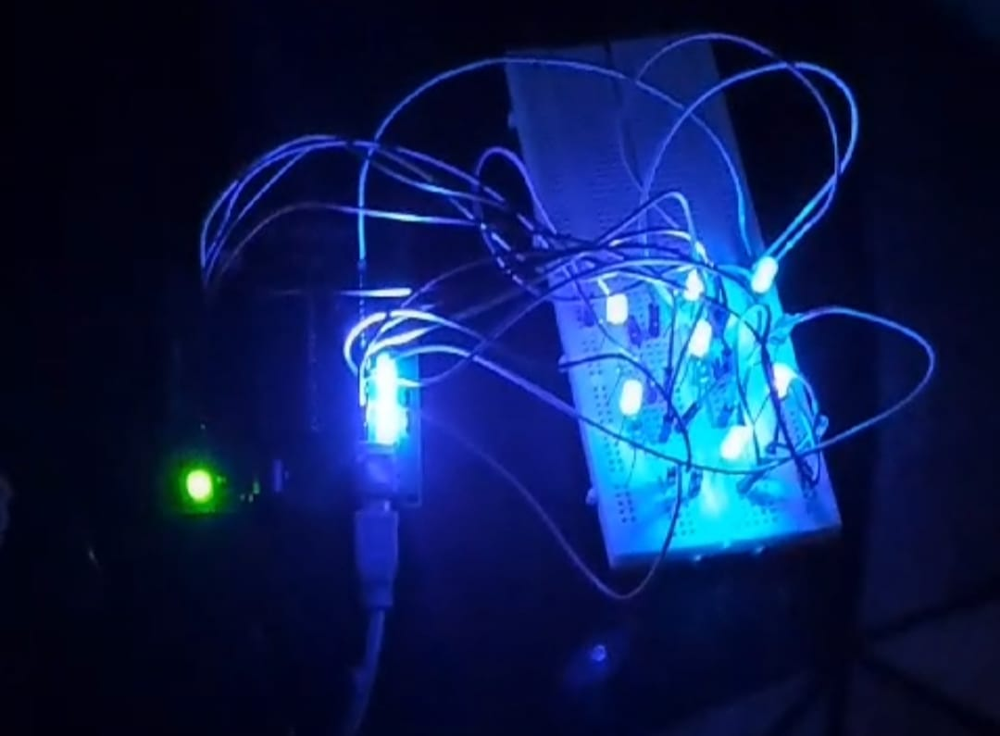
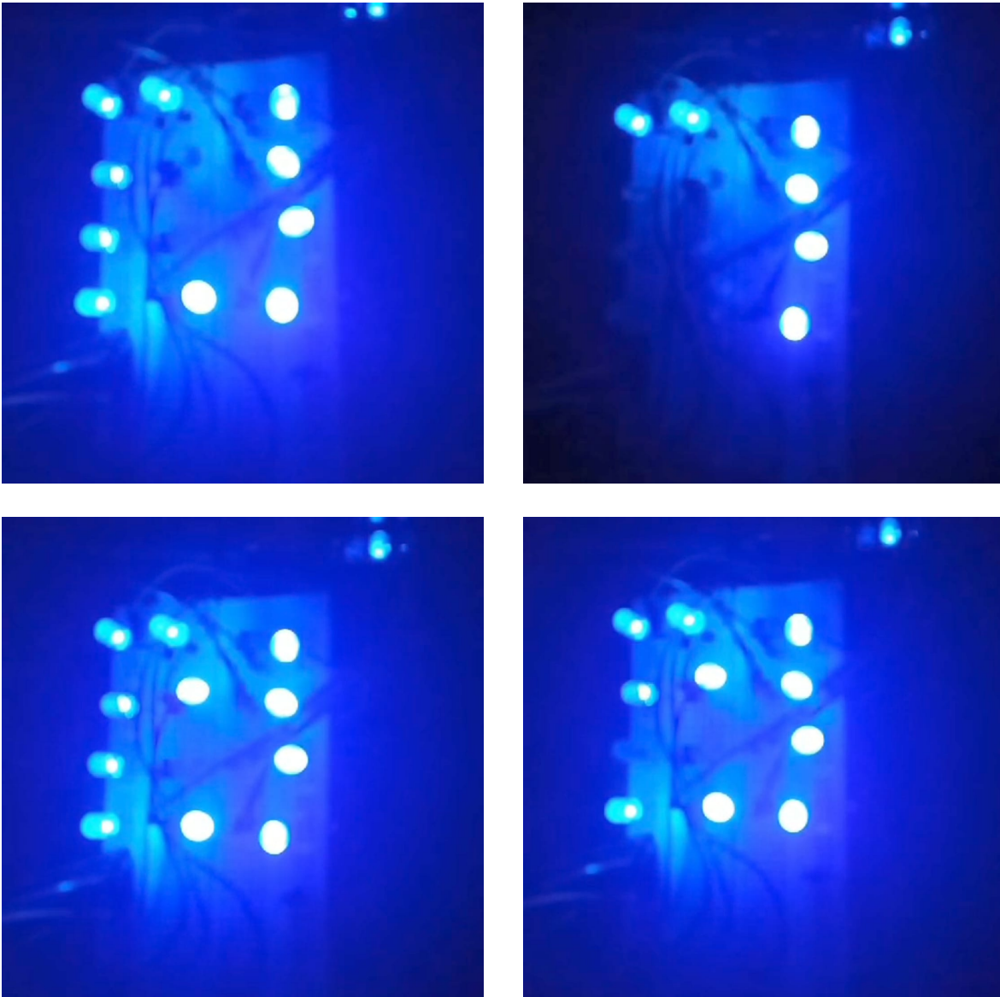

# LED Counter (3×4 LED Digit Display)

## 📌 Overview
This project implements a **3×4 LED digit counter** that displays numbers from `0` to `9` using the **Nuvoton W78E052D** 8051 microcontroller.  
Unlike multiplexed displays, **each LED is individually controlled** via direct microcontroller outputs, making it simple and beginner-friendly.

---

## ✨ Features
- Direct control of **12 LEDs** (no multiplexing)
- **3×4 matrix arrangement** to display digits
- Simple hardware logic for 8051 microcontroller
- Counts from 0 to 9 with delay between transitions
- Fully compatible with **Nuvoton W78E052D**

---

## 🛠 Theory of Operation
### 1. 3×4 LED Arrangement
The LEDs are arranged in **4 rows and 3 columns**, each connected to a specific pin of the microcontroller.  
Each digit is displayed by turning ON (`●`) or OFF (`○`) the correct LEDs according to a predefined pattern.

---

### 2. LED Patterns for Digits (0–9)

| Digit | Pattern |
|-------|---------|
| 0 | ● ● ● ● ○ ● ● ○ ● ● ● ● |
| 1 | ○ ● ○ ● ● ○ ○ ● ○ ● ● ● |
| 2 | ○ ● ○ ● ○ ● ○ ● ○ ● ● ● |
| 3 | ● ● ● ○ ● ○ ● ○ ● ○ ● ○ |
| 4 | ● ○ ● ● ● ● ○ ○ ● ○ ○ ● |
| 5 | ● ● ● ● ● ● ○ ○ ● ● ● ● |
| 6 | ● ● ● ● ○ ○ ● ● ● ● ● ● |
| 7 | ● ● ● ○ ○ ○ ○ ● ○ ● ○ ○ |
| 8 | ● ● ● ● ● ● ● ○ ● ● ● ● |
| 9 | ● ● ● ● ● ● ○ ○ ● ● ● ● |

**Legend:**  
`●` = LED ON  
`○` = LED OFF

---

### 3. Direct Control
No multiplexing is used — each LED has its own microcontroller output pin.  
This means:
- No need for row/column scanning
- Each LED state is set directly in software
- Easier to understand for beginners

---

## 🔌 Hardware Connections & Schematic

| LED   | Pin   | Description                |
|-------|-------|----------------------------|
| LED1  | P1.1  | Row 1, Column 1             |
| LED2  | P1.2  | Row 1, Column 2             |
| LED3  | P1.3  | Row 1, Column 3             |
| LED4  | P1.4  | Row 2, Column 1             |
| LED5  | P1.5  | Row 2, Column 2             |
| LED6  | P1.6  | Row 2, Column 3             |
| LED7  | P1.7  | Row 3, Column 1             |
| LED8  | P2.0  | Row 3, Column 2             |
| LED9  | P2.1  | Row 3, Column 3             |
| LED10 | P2.2  | Row 4, Column 1             |
| LED11 | P2.3  | Row 4, Column 2             |
| LED12 | P2.4  | Row 4, Column 3             |

**Schematic Diagram:**  

---

## 📷 Images
### Breadboard Prototype

### LED Display

---

## 🎥 Video Demo
[▶ Watch the Demo Video on Google Drive](https://drive.google.com/file/d/18hk5LdeibKrLbNs9CSVs4PtyMj-ImLJP/view?usp=sharing)

---

## 📈 Future Improvements
- Add **two-digit counter** support  
- Implement **reset button**  
- Use **shift registers** to save MCU pins  
- Create **custom characters** in the LED grid  

